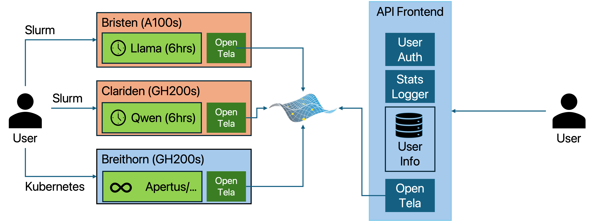

# How SwissAI Uses OpenTela for Scalable LLM Serving

Access to large language models (LLMs) has been crucial for modern AI research and applications. However, serving LLMs at scale, particularly on HPC environments like [Alps](https://www.cscs.ch/computers/alps) can be challenging. Swiss AI Initiative (in short, SwissAI) has been leveraging OpenTela to serve LLMs on HPC clusters, enabling researchers to access powerful models without the need for extensive infrastructure setup. In this article, we will explore how SwissAI uses OpenTela for scalable LLM serving.

## Challenge

HPC environments are designed for high-performance computing tasks, but they are not optimized for serving LLMs. Here, we demonstrate the challenge with a simple example workflow without using OpenTela.

If a researcher wants to access an LLM, assuming they have access to the HPC, the model and the necessary dependencies, they would need to: 1) set up the environment with the required libraries and frameworks, 2) submit a job to the HPC scheduler to run the model, and 3) wait for the job to be scheduled and executed, 4) send requests to the model once it is running from the same HPC environment 5) manage the lifecycle of the job. Usually there is a time limit for the job and if the job is killed, the researcher would need to re-submit the job and re-establish connection to the model.

This process can be time-consuming and inefficient, with the following main issues:

- **Operational Complexity and Redundancy**: Setting up the environment and managing jobs is a complex process. In many cases, some other researcher is already running the same model but other researchers have to setup their own environment and submit their own jobs, which can lead to duplicated efforts and inefficient resource usage.
- **Lack of Native Orchestration**: Scaling beyond a single instance requires a custom control plane to manage request routing, instance health, and failover. Without an integrated orchestration layer, researchers are forced to build bespoke solutions to handle the transient nature of HPC compute nodes.
- **Multi-tenant**: In many cases, multiple researchers may want to access the same model, however, HPC environments are not well-suited for multi-tenant applications. As a result, researchers cannot easily share access to the same model instance and batch requests together -- which can lead to inefficient resource usage.
- **Hardware and Geographic Interoperability**: Alps is composed of diverse, geo-distributed clusters with varying GPU architectures and configurations. Scaling LLM serving across these heterogeneous environments requires a solution that can abstract away hardware differences and provide seamless interoperability, which is not natively supported in HPC environments.

In conclusion, while HPC environments are powerful, they are not designed for serving LLMs at scale. Researchers need to set up and manage their own environments and jobs, which can be complex and inefficient. This is where OpenTela comes in.

## Benefits of using OpenTela

OpenTela provides a thin, user-space layer that allows researchers to easily share access to LLMs running on HPC clusters. By functioning as a decentralized overlay, it offers several critical advantages:

- **Simplified Access**: Researchers and students, if they only need to access the model, can simply send requests to the OpenTela endpoint without worrying about the underlying infrastructure anymore. This eliminates the need for complex environment setup and job management, allowing researchers to focus on their work rather than infrastructure.
- **Multi-tenancy**: OpenTela allows multiple researchers to multiplex their requests to the same model instance, enabling efficient resource usage and reducing operational overhead. This improves aggregate throughput and resource utilization compared to isolated batch jobs.
- **Cloud-Native Orchestration in User-Space**: Researchers gain "cloud-like" features—including service discovery, load balancing, and health monitoring—entirely within their standard user permissions. This removes the need for administrative root access or complex Kubernetes deployments on shared HPC infrastructure.
- **Hardware and Geographic Interoperability**: OpenTela connects different sub-clusters within Alps, allowing researchers to access LLMs running on different hardware and in different geographic locations seamlessly.

## How SwissAI Serving Platform leverages OpenTela

SwissAI has built a serving platform that leverages OpenTela to provide scalable LLM serving on HPC clusters. The high-level architecture of the platform is as follows:

On the left side, some users (often researchers or students in the SwissAI community) are granted access to the Alps super-clusters. They use slurm cluster manager to submit jobs to run LLMs on the HPC clusters. SwissAI includes three sub-clusters in Alps:

- **Bristen**: A small cluster with A100 GPUs and x86-64 CPUs. It is used for small-scale experiments and development and often less busy. It uses `slurm` as the cluster manager.
- **Clariden**: A large cluster with GH200 superchips (H100 GPUs and ARM CPUs). It is used for large-scale experiments and production workloads. It also uses `slurm` as the cluster manager.
- **Breithorn**: A small kubernetes-managed cluster with GH200 superchips. It is intended to be used for long-running workloads like LLM-serving. It uses `kubernetes` as the cluster manager.

Although there is a kubernetes cluster, it is rather small and cannot fulfill the demands from the research community. Thus, most researchers use the slurm clusters to submit jobs to run LLMs on the HPC clusters, and the kubernetes cluster is used for a few models that we plan to serve in a long-running manner. Currently, only Apertus models and a few other models that we collectively believe are worth serving 24/7 are deployed on the kubernetes cluster. The rest of the models are deployed on the slurm clusters.

No matter where the models are deployed (slurm or kubernetes, bristen or clariden or breithorn), they are wired together using OpenTela and behaves like a single pool of models to the users. In the API frontend (which is deployed on a kubernetes cluster), a head node of OpenTela is running 24/7 to route the requests to the corresponding model instances running on the slurm clusters or the kubernetes cluster. The API frontend also includes user management and access control, as well as some basic statistics and monitoring features. The implementation of this API frontend can be found [here](https://github.com/swiss-ai/fm-service).

By using OpenTela, SwissAI enables:

- Researchers to spin up LLM instances on demand, and contribute to a shared pool of models that can be accessed by others.
- Students and researchers to access LLMs without needing to manage the underlying infrastructure, allowing them to focus on their research and applications.
- The shared pool of models is efficiently utilized, as multiple users can access the same model instance, and the platform can scale across different clusters and hardware configurations seamlessly.

## Conclusion

The Swiss AI Initiative's integration of OpenTela represents a significant shift toward a more sovereign and collaborative AI infrastructure. By leveraging OpenTela's decentralized architecture, SwissAI built a platform where traditional HPC clusters can be used as a shared pool where every researchers can benefit from and contribute to. It also effectively converts fragmented, idle GPU capacity into a unified, accessible resource for the research community. You can view the real-time status of the models served by SwissAI on the [Swiss AI Research Platform](https://serving.swissai.cscs.ch/). If you are interested in learning more about how SwissAI uses OpenTela, please feel free to reach out to us!
